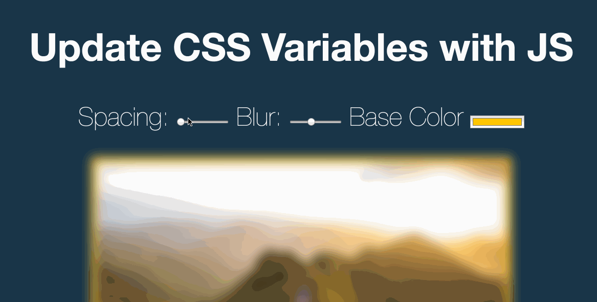

## css-variables ##

This web application was designed to demonstrate how JavaScript can be used to manipulate CSS variables. The user controls 3 attributes of an image on the app: spacing, blur, and base color. By adjusting sliders and selecting a color from a palette, the user can adjust the image to their liking by changing these attributes.

